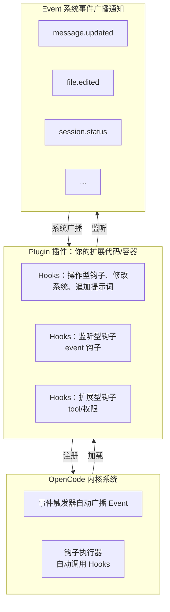
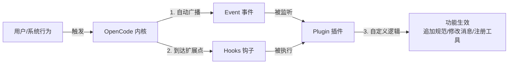

# OpenCode Hooks 与 Plugin 使用手册

> 整合了 OpenCode Hooks 与 Plugin 的概念辨析、三层架构机制、插件安装管理、Hooks 参数详解、Plugin 开发调试及社区生态推荐的完整指南。

---

## 目录

1. [认识 Hooks、Event 与 Plugin](#一认识-hooksevent-与-plugin)
2. [插件管理](#二插件管理)
3. [Plugin 结构详解](#三plugin-结构详解)
4. [Plugin 开发与调试](#四plugin-开发与调试)
5. [社区插件推荐](#五社区插件推荐)

---

## 一、认识 Hooks、Event 与 Plugin

### 1.1 核心一句话总结

**Plugin（插件）是容器，Hooks（钩子）是插件的「操作权限/接口」，Event（事件）是系统的「广播通知」**
三者是**包含 + 调用**的关系：**插件里写钩子，钩子监听/使用系统事件**

### 1.2 通俗比喻（餐厅模型）

把 **OpenCode 系统** 比作一家**餐厅**：
1. **Plugin（插件）** = 你开的**第三方定制服务**（比如：给菜品加专属调料、提供额外服务）
2. **Hooks（钩子）** = 餐厅**预留的官方服务窗口**（只有通过这些窗口，你才能修改菜品、服务客人）
3. **Event（事件）** = 餐厅**广播喇叭**（自动播报：客人到店、菜品出锅、订单完成）

### 1.3 精准定义 & 核心作用

#### 1.3.1 Plugin（插件）
- **是什么**：独立的**功能扩展包/载体**，是你扩展 OpenCode 的**唯一方式**
- **角色**：**容器** → 所有自定义代码（Hooks、业务逻辑）都必须写在插件里
- **特点**：独立文件、可插拔、不入侵系统核心
- **对应你之前的代码**：整个 `opencode-plugin-coding-standard.js` 文件就是一个插件

#### 1.3.2 Hooks（钩子）
- **是什么**：OpenCode **官方预留的接口/拦截点**
- **角色**：插件的**能力入口/操作权限** → 插件必须通过 Hooks 才能修改系统、添加功能
- **特点**：**主动操作**、可以**修改/拦截/扩展**系统、同步阻塞（系统会等插件执行完）
- **对应你之前的代码**：
  ```typescript
  "experimental.chat.system.transform" // 钩子：修改系统提示词
  "chat.message" // 钩子：修改用户消息
  ```

#### 1.3.3 Event（事件）
- **是什么**：OpenCode **运行时自动发出的广播通知**
- **角色**：系统的**状态信号** → 告诉插件/外部「发生了什么事」
- **特点**：**被动接收**、只能监听、不能修改系统、不阻塞流程
- **例子**：`file.edited`(文件修改)、`message.updated`(消息更新)、`session.created`(会话创建)

### 1.4 三者的关系（流程图）

#### 1.4.1 层级结构图（谁包含谁、核心关系）


#### 1.4.2 工作流程图（触发逻辑、联动关系）


#### 1.4.3 关键绑定关系
1. **没有 Plugin，就无法使用 Hooks**（你没有服务载体，就用不了餐厅的窗口）
2. **没有 Hooks，插件无法操作/监听系统**（没有窗口，你啥也干不了）
3. **Event 是系统自动发的，Hooks 是唯一能监听 Event 的方式**（只有通过服务窗口，才能听到餐厅广播）

### 1.5 核心区别（表格速查）

| 维度 | Plugin（插件） | Hooks（钩子） | Event（事件） |
|------|----------------|---------------|---------------|
| 本质 | 扩展容器/代码文件 | 系统预留的操作接口 | 系统运行的广播通知 |
| 主动/被动 | 你编写的自定义扩展 | 插件**主动调用**接口 | 系统**主动广播**，插件被动监听 |
| 能否改系统 | 本身不能，靠 Hooks 改 | **可以修改/拦截/扩展系统** | **不能修改系统，仅通知** |
| 触发方式 | 系统启动时加载 | 系统运行到关键节点自动触发 | 系统发生动作时自动广播 |
| 你的代码位置 | 整个插件文件 | 插件里的函数（如 chat.message） | 插件里 `event` 钩子接收 |

---

## 二、插件管理

### 2.1 安装插件

#### 2.1.1 配置钩子（JSON/JSONC）

在 `opencode.jsonc` 的 `experimental.hook` 节点中配置。

#### 2.1.2 插件钩子（TS/JS 模块）

**从本地文件加载**

将 JavaScript 或 TypeScript 文件放置在插件目录中。

```
.opencode/plugins/ - 项目级插件
~/.config/opencode/plugins/ - 全局插件
```

这些目录中的文件会在启动时自动加载。本地插件可使用外部 npm 包。在配置目录（`.opencode/` 或 `~/.config/opencode/`）添加 `package.json`，OpenCode 启动时会自动运行 `bun install`。

package.json 示例：

```json
{
  "dependencies": {
    "shescape": "^2.1.0"
  }
}
```

**从 npm 加载第三方插件**

在 opencode.json 配置文件中指定 npm 包。

```json
{
  "$schema": "https://opencode.ai/config.json",
  "plugin": [
    "opencode-claude-hooks"
  ]
}
```

支持常规和带作用域的 npm 包。npm 插件在启动时使用 Bun 自动安装。包及其依赖项会缓存在 `~/.cache/opencode/node_modules/` 中。

**插件加载位置**（优先级依次）：
1. 项目级插件：`.opencode/plugin/` 目录下的 `.ts` 文件
2. 全局插件：`~/.config/opencode/plugin/` 目录
3. npm 包：在 `opencode.json` 中通过 `plugin` 数组配置

### 2.2 查看已安装插件

**查看 npm 安装的插件**：

通过配置文件查看：

```json
{
  "$schema": "https://opencode.ai/config.json",
  "plugin": [
    "opencode-notify",
    "opencode-skillful",
    "@my-org/custom-plugin"
  ]
}
```

查看位置：
- 项目级：`./opencode.json`
- 全局：`~/.config/opencode/opencode.json`

**查看本地文件插件**：

```bash
# 项目级本地插件
ls .opencode/plugins/

# 全局本地插件
ls ~/.config/opencode/plugins/

# 自定义配置目录
ls $OPENCODE_CONFIG_DIR/plugins/
```

### 2.3 卸载插件

**卸载 npm 插件**：

编辑 `opencode.json`，从 `plugin` 数组中删除目标插件即可，无需手动运行 `npm uninstall`。

清理缓存（彻底删除）：

```bash
# 删除特定插件
rm -rf ~/.cache/opencode/node_modules/opencode-skillful

# 或清空整个插件缓存（下次启动会重新安装保留的插件）
rm -rf ~/.cache/opencode/node_modules/
```

**卸载本地文件插件**：

```bash
# 项目级插件
rm .opencode/plugins/my-plugin.ts

# 全局插件
rm ~/.config/opencode/plugins/my-plugin.ts
```

**卸载后验证**：

重启 OpenCode 并观察启动日志，确认目标插件不再出现。

---

## 三、Plugin 结构详解

### 3.1 基础结构

插件是一个导出 `Plugin` 函数的 JS/TS 模块，接收上下文对象，返回 hooks 对象：

```typescript
import { Plugin, tool } from '@opencode-ai/plugin'

export const MyPlugin: Plugin = async (ctx) => {
  console.log("Plugin initialized!")
  return {
    "file.edited": async (path) => {
      // 处理逻辑
    }
  }
}
```

### 3.2 ctx 上下文详解

`ctx`（官方类型名为 `PluginInput`）是 OpenCode 插件入口函数接收的运行时上下文对象，包含 6 个顶级字段。

```typescript
type PluginInput = {
  client: ReturnType<typeof createOpencodeClient>  // SDK 客户端
  project: Project                                  // 当前项目信息
  directory: string                                 // 工作目录
  worktree: string                                  // Git 工作树根目录
  serverUrl: URL                                    // Server 地址
  $: BunShell                                       // Bun Shell（执行命令）
}
```

> `ctx` 是 OpenCode 给插件的"全权限通行证"：用 `client` 操控会话，用 `project/directory/worktree` 定位项目，用 `$` 执行命令，用 `serverUrl` 对接内部服务。所有字段在插件初始化时注入，通过闭包共享给各 Hook 使用。

#### 3.2.1 `client` — OpenCode SDK 客户端

| 属性 | 类型 | 说明 |
|------|------|------|
| `client` | `OpencodeClient` | 内部 SDK 客户端，直接与 OpenCode Server（`localhost:4096`）通信 |

**关键能力**
- 读取配置：`client.config.get()` — 获取当前模型、提供商等配置
- 会话操作：`client.session.prompt({ path: { id }, body: { parts } })` — 向指定会话发送消息（如实现 `notify` 工具）
- 触发压缩：`client.session.summarize()` — 手动触发会话上下文压缩
- 内部通信：client 使用内部 `fetch` 直接调用 Server，不走真实网络，延迟极低

**典型用法**

```typescript
export default async (ctx) => {
  const { client } = ctx

  // 获取当前配置
  const config = await client.config.get()
  console.log('Current model:', config.data.model)

  return {
    tool: {
      notify: tool({
        async execute({ text }, toolCtx) {
          // 向当前会话发通知（不期待回复）
          await client.session.prompt({
            path: { id: toolCtx.sessionID },
            body: { noReply: true, parts: [{ type: 'text', text }] },
          })
          return 'Notified'
        },
      }),
    },
  }
}
```

#### 3.2.2 `project` — 当前项目信息

| 属性 | 类型 | 说明 |
|------|------|------|
| `project.id` | `string` | 项目唯一标识（Git 仓库的 hash，非 Git 项目则为 `"global"`） |
| `project.worktree` | `string` | Git worktree 根目录的绝对路径 |
| `project.vcs` | `"git" \| undefined` | 版本控制系统类型，非 Git 仓库时为 `undefined` |

与 `ctx.worktree` 的关系：`ctx.worktree` 是 `ctx.project.worktree` 的别名，两者值相同。

**典型用法**

```typescript
export default async ({ project, worktree }) => {
  console.log('Project ID:', project.id)           // e.g., "a1b2c3d"
  console.log('Worktree:', project.worktree)      // e.g., "/home/user/my-project"
  console.log('VCS:', project.vcs)                // "git" or undefined
  console.log('Alias check:', worktree === project.worktree)  // true
}
```

#### 3.2.3 `directory` — 当前工作目录

| 属性 | 类型 | 说明 |
|------|------|------|
| `directory` | `string` | 当前工作目录的绝对路径（OpenCode 启动时的 `cwd`） |

**与 `worktree` 的区别**
- `directory`：OpenCode 启动时的目录（可能是子目录）
- `worktree`：Git 仓库根目录

如果你在 monorepo 的子包中启动 OpenCode，`directory` 是子包路径，`worktree` 是仓库根目录。

#### 3.2.4 `worktree` — Git 工作树根目录

| 属性 | 类型 | 说明 |
|------|------|------|
| `worktree` | `string` | Git worktree 根目录绝对路径（与 `project.worktree` 等价） |

**用途**
- 执行跨子项目的 Git 命令时，确保在仓库根目录操作
- 构建相对于项目根的路径

```typescript
export default async ({ worktree, $ }) => {
  // 在仓库根目录执行 git log
  const log = await $`cd ${worktree} && git log --oneline -5`
}
```

#### 3.2.5 `serverUrl` — 内嵌 Server 地址

| 属性 | 类型 | 说明 |
|------|------|------|
| `serverUrl` | `URL` | OpenCode 内嵌 HTTP Server 的地址（通常为 `http://localhost:4096`） |

**用途**
- 插件需要构造指向 OpenCode 内部 API 的 URL 时使用
- 与其他本地服务（如插件自己启动的 HTTP 服务器）做地址协调

```typescript
export default async ({ serverUrl }) => {
  console.log('Server running at:', serverUrl.toString())  // "http://localhost:4096"
}
```

#### 3.2.6 `$` — Bun Shell API

| 属性 | 类型 | 说明 |
|------|------|------|
| `$` | `BunShell` | Bun 提供的 Shell 执行器，支持模板字符串语法 |

**核心特性**
- 模板字符串：`` $`command arg1 arg2` ``
- 输出方法：`.text()`（文本）、`.json()`（JSON）、`.arrayBuffer()` 等
- 变量注入：直接嵌入变量，Bun 自动转义
- 当前目录：默认在 `ctx.directory` 下执行

**典型用法**

```typescript
export default async ({ $ }) => {
  // 1. 简单命令
  const status = await $`git status --porcelain`
  console.log(status.text())

  // 2. 带变量的命令（自动转义）
  const branch = 'main'
  await $`git checkout ${branch}`

  // 3. 管道
  const count = await $`git log --oneline | wc -l`

  // 4. 在工具中使用
  return {
    tool: {
      gitStatus: tool({
        async execute() {
          const result = await $`git status --porcelain`
          return result.text() || 'Working tree clean'
        },
      }),
    },
  }
}
```

### 3.3 Hooks 与 Events 完整总结

#### Hooks（插件扩展钩子）

Hooks 是 OpenCode 提供给**插件**的核心扩展接口，用于拦截、修改、扩展系统核心功能，所有钩子均为异步方法。

| Hook 名称 | 核心作用 | 输入参数 | 输出参数（可修改） |
|-----------|----------|----------|--------------------|
| `event` | 全局事件监听，接收所有系统事件 | `event: Event` - 系统触发的完整事件对象 | 无 |
| `config` | 全局配置修改，自定义系统配置 | `config: Config` - 原始配置对象 | 无（直接修改配置） |
| `tool` | 注册自定义工具，扩展系统工具集 | 无 | `Record<string, ToolDefinition>` - 自定义工具集合 |
| `auth` | 扩展认证方式，自定义模型提供商认证 | 无 | `AuthHook` - 自定义 OAuth/API 认证配置 |
| `provider` | 扩展模型提供商，自定义模型列表 | `provider: ProviderV2, ctx: ProviderHookContext` | `Record<string, ModelV2>` - 自定义模型 |
| `chat.message` | 接收新聊天消息时触发 | `sessionID, agent, model, messageID`；`message: UserMessage, parts: Part[]` | 无 |
| `chat.params` | 修改 LLM 请求参数（温度、TopP 等） | `sessionID, agent, model, provider, message` | `temperature, topP, topK, maxOutputTokens, options` |
| `chat.headers` | 修改 LLM 请求头 | `sessionID, agent, model, provider, message` | `headers: Record<string, string>` |
| `permission.ask` | 拦截权限申请，自定义权限策略 | `input: Permission` - 权限申请信息 | `status: ask/deny/allow` - 权限决策 |
| `command.execute.before` | 命令执行前拦截 | `command, sessionID, arguments` | `parts: Part[]` - 自定义消息片段 |
| `tool.execute.before` | 工具执行前拦截，修改入参 | `tool, sessionID, callID` | `args: any` - 工具执行参数 |
| `shell.env` | 自定义 Shell 执行环境变量 | `cwd, sessionID, callID` | `env: Record<string, string>` |
| `tool.execute.after` | 工具执行后拦截，修改结果 | `tool, sessionID, callID, args` | `title, output, metadata` - 工具输出 |
| `tool.definition` | 修改工具描述/参数（给 LLM 的定义） | `toolID: string` | `description, parameters` - 工具元数据 |
| `experimental.chat.messages.transform` | 实验性：转换聊天消息列表 | 无 | `messages` - 消息列表 |
| `experimental.chat.system.transform` | 实验性：修改 LLM 系统提示词 | `sessionID, model` | `system: string[]` - 系统提示词 |
| `experimental.session.compacting` | 实验性：会话压缩前自定义提示词 | `sessionID: string` | `context, prompt` - 压缩提示词 |
| `experimental.compaction.autocontinue` | 实验性：控制压缩后是否自动继续 | `sessionID, agent, model, message, overflow` | `enabled: boolean` |
| `experimental.text.complete` | 实验性：自定义文本补全结果 | `sessionID, messageID, partID` | `text: string` - 补全文本 |

#### Events（系统运行时事件）

Events 是 OpenCode 运行时触发的**状态/行为通知事件**，通过事件订阅可监听系统全生命周期动作，所有事件包含固定 `type` 和 `properties` 参数。

| 事件类型 (type) | 触发时机 | 事件参数 (properties) |
|-----------------|----------|----------------------|
| `server.instance.disposed` | 服务实例销毁时 | `directory: string` - 实例工作目录 |
| `installation.updated` | 系统版本更新完成时 | `version: string` - 更新后的版本号 |
| `installation.update-available` | 有新版本可更新时 | `version: string` - 可用新版本号 |
| `lsp.client.diagnostics` | LSP 客户端诊断信息更新时 | `serverID: string` - LSP 服务 ID；`path: string` - 文件路径 |
| `lsp.updated` | LSP 服务状态更新时 | 任意键值对扩展参数 |
| `message.updated` | 聊天消息更新时 | `info: Message` - 完整消息对象 |
| `message.removed` | 聊天消息删除时 | `sessionID: string` - 会话 ID；`messageID: string` - 消息 ID |
| `message.part.updated` | 消息片段（文本/工具/文件）更新时 | `part: Part` - 消息片段；`delta?: string` - 增量内容 |
| `message.part.removed` | 消息片段删除时 | `sessionID, messageID, partID` - 唯一标识 |
| `permission.updated` | 权限配置更新时 | `Permission` - 完整权限对象 |
| `permission.replied` | 权限申请响应时 | `sessionID, permissionID, response: once/always/reject` |
| `session.status` | 会话状态变更时 | `sessionID: string`；`status: idle/retry/busy` - 会话状态 |
| `session.idle` | 会话进入空闲状态时 | `sessionID: string` |
| `session.compacted` | 会话压缩完成时 | `sessionID: string` |
| `file.edited` | 文件被编辑修改时 | `file: string` - 编辑的文件路径 |
| `todo.updated` | 任务列表更新时 | `sessionID: string`；`todos: Todo[]` - 任务列表 |
| `command.executed` | 系统命令执行完成时 | `name, sessionID, arguments, messageID` |
| `session.created` | 新会话创建时 | `info: Session` - 会话信息 |
| `session.updated` | 会话信息更新时 | `info: Session` - 会话信息 |
| `session.deleted` | 会话删除时 | `info: Session` - 会话信息 |
| `session.diff` | 会话文件差异生成时 | `sessionID: string`；`diff: FileDiff[]` - 文件差异列表 |
| `session.error` | 会话发生错误时 | `sessionID?: string`；`error?: 系统错误类型` |
| `file.watcher.updated` | 文件监听器检测到文件变化时 | `file: string` - 文件路径；`event: add/change/unlink` - 变化类型 |
| `vcs.branch.updated` | 代码仓库分支切换时 | `branch?: string` - 当前分支名 |
| `tui.prompt.append` | TUI 终端输入框追加内容时 | `text: string` - 追加的文本 |
| `tui.command.execute` | TUI 终端执行命令时 | `command: string` - 执行的命令 |
| `tui.toast.show` | TUI 终端弹出提示时 | `title?: string, message: string, variant: info/success/warning/error, duration?: number` |
| `pty.created` | 伪终端创建时 | `info: Pty` - 终端信息 |
| `pty.updated` | 伪终端状态更新时 | `info: Pty` - 终端信息 |
| `pty.exited` | 伪终端退出时 | `id: string` - 终端 ID；`exitCode: number` - 退出码 |
| `pty.deleted` | 伪终端删除时 | `id: string` - 终端 ID |
| `server.connected` | 服务连接成功时 | 任意键值对扩展参数 |

#### 总结

1. **Hooks** 是**插件主动扩展**的入口，用于拦截/修改系统行为，共 19 个核心钩子（含实验性）
2. **Events** 是**系统被动通知**的信号，用于监听运行时状态，共 31 个系统事件
3. 两者配合可实现 OpenCode 全功能定制：插件通过 Hooks 扩展能力，通过 Events 监听系统状态

**Hooks = 拦截 / 修改 / 扩展**
- `event`：收所有事件
- `config`：改配置
- `tool`：加工具
- `chat.message`：收消息
- `chat.params`：改 AI 参数
- `permission.ask`：控权限
- `command.execute.before`：命令前
- `tool.execute.before/after`：工具前后

**Events = 系统广播**
- `message.updated` 消息变了
- `file.edited` 文件改了
- `session.status` 会话忙闲
- `command.executed` 命令跑完
- `server.connected` 服务启动

### 3.4 Hooks + Events 完整示例

以下示例展示了 opencode 中所有 Hooks、Events 的调用，用输出 log 的方式展示了 Hooks、Events 的参数。

```typescript
import { Plugin } from '@opencode-ai/plugin'
import { writeFileSync } from 'fs'

function fileLog(msg: string) {
  const line = `[${new Date().toISOString()}] ${msg}\n`
  writeFileSync('./opencode-events.log', line, { flag: 'a' })
}

export const MyPlugin = (async (ctx) => {
  const { project, directory } = ctx

  console.log(`✅ [INIT] Plugin loaded for project ${project.id} at ${directory}`)
  fileLog(`[INIT] Plugin loaded for project ${project.id} at ${directory}`)

  return {
    // ═══════════════════════════════════════════════════════════════════════
    // 1. permission.ask Hook — 权限自动管控
    // ═══════════════════════════════════════════════════════════════════════
    'permission.ask': async (input, output) => {
      const { type, pattern, metadata } = input
      const { status } = output

      fileLog(`[PERMISSION.ASK] input: type=${type} pattern=${pattern} metadata=${JSON.stringify(metadata)}`)
      fileLog(`[PERMISSION.ASK] output: status=${status}`)
    },

    // ═══════════════════════════════════════════════════════════════════════
    // 2. shell.env Hook — 环境变量注入
    // ═══════════════════════════════════════════════════════════════════════
    'shell.env': async (input, output) => {
      const { cwd, sessionID, callID } = input
      const { env } = output

      fileLog(`[SHELL.ENV] input: cwd=${cwd} session=${sessionID} call=${callID}`)
      fileLog(`[SHELL.ENV] output: env=${JSON.stringify(env)}`)
    },

    // ═══════════════════════════════════════════════════════════════════════
    // 3. tool.execute.before Hook — 工具执行前拦截
    // ═══════════════════════════════════════════════════════════════════════
    'tool.execute.before': async (input, output) => {
      const { tool, sessionID, callID } = input
      const { args } = output

      fileLog(`[tool.execute.before] input: tool=${tool} session=${sessionID} call=${callID}`)
      fileLog(`[tool.execute.before] output: tool=${tool} args=${JSON.stringify(args)}`)
    },

    // ═══════════════════════════════════════════════════════════════════════
    // 4. tool.execute.after Hook — 工具执行后处理
    // ═══════════════════════════════════════════════════════════════════════
    'tool.execute.after': async (input, output) => {
      const { tool, sessionID, callID, args } = input
      const { title, output: toolOutput, metadata } = output

      fileLog(`[tool.execute.after] input: tool=${tool} session=${sessionID} call=${callID} args=${JSON.stringify(args)} metadata=${JSON.stringify(metadata)}`)
      fileLog(`[tool.execute.after] output: tool=${tool} outputLen=${toolOutput?.length || 0} title=${title}${metadata ? ` metadata=${JSON.stringify(metadata)}` : ''}`)
    },

    // ═══════════════════════════════════════════════════════════════════════
    // 5. event 事件监听器 — 全局事件监控
    // ═══════════════════════════════════════════════════════════════════════
    event: async ({ event }) => {
      const properties = event.properties as any

      switch (event.type as string) {

        // ──── 命令事件 ────
        case 'command.executed': {
          fileLog(`[command.executed] name=${properties.name} arguments=${properties.arguments || ''} session=${properties.sessionID} message=${properties.messageID || ''}`)
          break
        }

        // ──── 文件事件 ────
        case 'file.edited': {
          fileLog(`[file.edited] file=${properties.file} event=${properties.event} session=${properties.sessionID}`)
          break
        }
        case 'file.watcher.updated': {
          fileLog(`[file.watcher.updated] event=${properties.event} file=${properties.file} session=${properties.sessionID}`)
          break
        }

        // ──── 安装事件 ────
        case 'installation.updated': {
          fileLog(`[installation.updated] version=${properties.version} session=${properties.sessionID} instance=${properties.instanceID}`)
          break
        }

        // ──── LSP 事件 ────
        case 'lsp.client.diagnostics': {
          fileLog(`[lsp.client.diagnostics] serverID=${properties.serverID} path=${properties.path} session=${properties.sessionID} diagnostics=${JSON.stringify(properties.diagnostics)}`)
          break
        }
        case 'lsp.updated': {
          fileLog(`[lsp.updated] version=${properties.version} session=${properties.sessionID} instance=${properties.instanceID} serverID=${properties.serverID} capabilities=${JSON.stringify(properties.capabilities)} metadata=${JSON.stringify(properties.metadata)}`)
          break
        }

        // ──── 消息事件 ────
        case 'message.updated': {
          const msg = properties.info
          if (!msg) {
            fileLog(`[message.updated] Updated (no info)`)
            break
          }
          if (msg.role === 'user') {
            fileLog(`[message.updated] id=${msg.id} agent=${msg.agent} model=${msg.model?.providerID}/${msg.model?.modelID} in session ${properties.sessionID} summary=${msg.summary ? 'yes' : 'no'} tokens=${msg.tokens?.input || 0}/${msg.tokens?.output || 0} error=${msg.error ? `${msg.error.name}: ${JSON.stringify(msg.error.data)}` : 'no'} finish=${msg.finish || 'no'}`)
          } else {
            fileLog(`[message.updated] Assistant id=${msg.id} model=${msg.modelID} tokens=${msg.tokens?.input || 0}/${msg.tokens?.output || 0} in session ${properties.sessionID} error=${msg.error ? `${msg.error.name}: ${JSON.stringify(msg.error.data)}` : 'no'} finish=${msg.finish || 'no'} summary=${msg.summary ? 'yes' : 'no'} parts=${msg.parts?.length || 0}`)
          }
          break
        }
        case 'message.removed': {
          fileLog(`[message.removed] messageID=${properties.messageID} from sessionID=${properties.sessionID}`)
          break
        }
        case 'message.part.updated': {
          const part = properties.part
          const delta = properties.delta
          if (!part) {
            fileLog(`[message.part.updated] Updated (no part)`)
            break
          }
          switch (part.type) {
            case 'text':
              fileLog(`[message.part.updated] text id=${part.id} messageID=${part.messageID} text=${part.text || ''} delta=${delta ? 'yes' : 'no'} session=${properties.sessionID}`)
              break
            case 'tool':
              fileLog(`[message.part.updated] tool id=${part.id} tool=${part.tool} status=${part.state?.status} delta=${delta ? 'yes' : 'no'} session=${properties.sessionID} message=${part.messageID}`)
              break
            case 'reasoning':
              fileLog(`[message.part.updated] reasoning id=${part.id} len=${part.text?.length || 0} delta=${delta ? 'yes' : 'no'} session=${properties.sessionID} message=${part.messageID}`)
              break
            case 'file':
              fileLog(`[message.part.updated] file id=${part.id} mime=${part.mime} name=${part.filename || 'unknown'} delta=${delta ? 'yes' : 'no'} session=${properties.sessionID} message=${part.messageID}`)
              break
            case 'step-start':
              fileLog(`[message.part.updated] step-start id=${part.id} delta=${delta ? 'yes' : 'no'} session=${properties.sessionID} message=${part.messageID} reason=${part.reason || ''} agent=${part.agent || ''} model=${part.model || ''}`)
              break
            case 'step-finish':
              fileLog(`[message.part.updated] step-finish id=${part.id} reason=${part.reason} cost=$${part.cost} delta=${delta ? 'yes' : 'no'} session=${properties.sessionID} message=${part.messageID}`)
              break
            case 'snapshot':
              fileLog(`[message.part.updated] snapshot id=${part.id} delta=${delta ? 'yes' : 'no'} session=${properties.sessionID} message=${part.messageID} reason=${part.reason || ''} agent=${part.agent || ''} model=${part.model || ''}`)
              break
            case 'patch':
              fileLog(`[message.part.updated] patch id=${part.id} files=${part.files?.length || 0} delta=${delta ? 'yes' : 'no'} session=${properties.sessionID} message=${part.messageID} reason=${part.reason || ''} agent=${part.agent || ''} model=${part.model || ''}`)
              break
            case 'agent':
              fileLog(`[message.part.updated] agent id=${part.id} name=${part.name} delta=${delta ? 'yes' : 'no'} session=${properties.sessionID} message=${part.messageID} reason=${part.reason || ''} agent=${part.agent || ''} model=${part.model || ''} source=${part.source ? '[source]' : 'no source'}`)
              break
            case 'retry':
              fileLog(`[message.part.updated] retry id=${part.id} attempt=${part.attempt} delta=${delta ? 'yes' : 'no'} session=${properties.sessionID} message=${part.messageID} reason=${part.reason || ''} agent=${part.agent || ''} model=${part.model || ''} error=${part.error ? `${part.error.name}: ${JSON.stringify(part.error.data)}` : 'no'}`)
              break
            case 'compaction':
              fileLog(`[message.part.updated] compaction id=${part.id} auto=${part.auto} delta=${delta ? 'yes' : 'no'} session=${properties.sessionID} message=${part.messageID} reason=${part.reason || ''} agent=${part.agent || ''} model=${part.model || ''}`)
              break
            default:
              fileLog(`[message.part.updated] unknown type=${part.type}`)
          }
          break
        }
        case 'message.part.removed': {
          fileLog(`[message.part.removed] Removed part=${properties.partID} from msg=${properties.messageID} in session=${properties.sessionID} reason=${properties.reason || ''} agent=${properties.agent || ''} model=${properties.model || ''}`)
          break
        }
        case 'message.part.delta': {
          fileLog(`[message.part.delta] Delta for part ${properties.partID} in msg ${properties.messageID} session ${properties.sessionID}: ${properties.delta ? 'yes' : 'no'} delta=${properties.delta ? properties.delta.substring(0, 40) + '...' : 'no'}`)
          break
        }

        // ──── 权限事件 ────
        case 'permission.updated': {
          fileLog(`[permission.updated] Updated id=${properties.id} type=${properties.type} session=${properties.sessionID} title="${properties.title}"`)
          break
        }
        case 'permission.replied': {
          fileLog(`[permission.replied] Replied id=${properties.permissionID} → ${properties.response} (session=${properties.sessionID}) reason=${properties.reason || ''} agent=${properties.agent || ''} model=${properties.model || ''}`)
          break
        }

        // ──── 服务器事件 ────
        case 'server.connected': {
          fileLog(`[server.connected] Connected to server at ${properties.directory} session=${properties.sessionID} instance=${properties.instanceID} version=${properties.version} pid=${properties.pid} port=${properties.port} env=${JSON.stringify(properties.env)} metadata=${JSON.stringify(properties.metadata)}`)
          break
        }

        // ──── 会话事件 ────
        case 'session.created': {
          const s = properties.info
          fileLog(`[session.created] Created: id=${s?.id || '?'} directory=${s?.directory || '?'} title="${s?.title || ''}" session=${properties.sessionID} version=${s?.version} time=${s ? new Date(s.time.created).toISOString() : '?'} summary=${s?.summary ? 'yes' : 'no'} instance=${s?.instanceID || '?'} metadata=${s ? JSON.stringify(s.metadata) : '{}'}`)
          break
        }
        case 'session.updated': {
          const s = properties.info
          fileLog(`[session.updated] Updated: ${s?.id || '?'} title="${s?.title || ''}" session=${properties.sessionID} version=${s?.version} time=${s ? new Date(s.time.updated).toISOString() : '?'} summary=${s?.summary ? 'yes' : 'no'}`)
          break
        }
        case 'session.deleted': {
          const s = properties.info
          fileLog(`[session.deleted] Deleted: ${s?.id || '?'} session=${properties.sessionID} title="${s?.title || ''}" version=${s?.version} time=${s ? new Date(s.time.updated).toISOString() : '?'} summary=${s?.summary ? 'yes' : 'no'}`)
          break
        }
        case 'session.compacted': {
          fileLog(`[session.compacted] Compacted: sessionID=${properties.sessionID} reason=${properties.reason || ''} agent=${properties.agent || ''} model=${properties.model || ''}`)
          break
        }
        case 'session.idle': {
          fileLog(`[session.idle] Idle: sessionID=${properties.sessionID} reason=${properties.reason || ''} agent=${properties.agent || ''} model=${properties.model || ''}`)
          break
        }
        case 'session.error': {
          const err = properties.error
          let errStr = 'unknown'
          if (err) {
            errStr = `${err.name}: ${err.data?.message || JSON.stringify(err.data)}`
          }
          fileLog(`[session.error] Error in ${properties.sessionID || '?'}: ${errStr} reason=${properties.reason || ''} agent=${properties.agent || ''} model=${properties.model || ''}`)
          break
        }
        case 'session.status': {
          const st = properties.status
          let detail = st.type
          if (st.type === 'retry') {
            detail += ` attempt=${st.attempt} next=${st.next}ms`
          }
          fileLog(`[session.status] Status: ${properties.sessionID} = ${detail} message=${st.message || ''}`)
          break
        }
        case 'session.diff': {
          fileLog(`[session.diff] Diff: ${properties.sessionID} files=${properties.diff?.length || 0} ${properties.diff ? JSON.stringify(properties.diff) : ''}`)
          break
        }

        // ──── 待办事项 ────
        case 'todo.updated': {
          const todos = properties.todos || []
          const done = todos.filter((t: any) => t.status === 'completed').length
          fileLog(`[todo.updated] ${done}/${todos.length} session=${properties.sessionID} todos=${JSON.stringify(todos)} reason=${properties.reason || ''} agent=${properties.agent || ''} model=${properties.model || ''}`)
          break
        }

        // ──── TUI 事件 ────
        case 'tui.prompt.append': {
          fileLog(`[tui.prompt.append] Prompt append: "${properties.text?.substring(0, 40)}..." in session ${properties.sessionID}`)
          break
        }
        case 'tui.command.execute': {
          fileLog(`[tui.command.execute] Command=${properties.command} in session=${properties.sessionID}`)
          break
        }
        case 'tui.toast.show': {
          fileLog(`[TUI] Toast [${properties.variant}]: ${properties.title ? `[${properties.title}] ` : ''}${properties.message} (session=${properties.sessionID}) duration=${properties.duration || 0}ms`)
          break
        }

        // ──── 兜底 ────
        default: {
          fileLog(`[OTHER] ${event.type}`)
          break
        }
      }
    },
  }
}) as Plugin
```

---

## 四、Plugin 开发与调试

### 4.1 开发实例

#### 4.1.1 示例1：会话任务完成左下角通知

创建文件：`session-notice.js`

```typescript
import type { Hooks } from "./index.d";
import notifier from "node-notifier";
import path from "path";

const NOTIFY_CONFIG = {
  title: "OpenCode 任务完成",
  message: "✅ 会话任务已执行完毕，可继续新任务",
  sound: false,
  wait: false,
  timeout: 3,
  type: "info",
};

export const server = async (): Promise<Hooks> => {
  return {
    async event({ event }) {
      if (event.type === "session.idle") {
        const { sessionID } = event.properties;

        notifier.notify({
          ...NOTIFY_CONFIG,
          message: `✅ 会话【${sessionID.slice(0, 6)}】任务已完成`,
          icon: path.join(__dirname, "opencode-icon.png"),
        });

        console.log("🔔 已发送任务完成桌面通知");
      }
    },
  };
};
```

#### 4.1.2 示例2：主动调用指定 Skill

创建文件：`active-skill.js`

```typescript
import type { Hooks } from "./index.d";

const ACTIVE_SKILLS = [
  "shell 命令执行",
  "文件读写（file_read/file_write）",
  "Git 操作",
  "代码搜索与查找",
  "项目结构分析",
  "代码格式化",
];

const SKILL_PROMPT = `
【强制执行规则：主动调用技能】
你必须**主动、积极、优先**调用以下技能，无需用户明确要求：
${ACTIVE_SKILLS.map((skill, i) => `${i + 1}. ${skill}`).join("\n")}

执行要求：
1. 只要场景匹配，直接调用技能，不询问用户
2. 能工具解决的，绝不只文字回答
3. 多步操作自动连续执行，无需人工介入
4. 调用技能后自动整理结果返回
`;

export const server = async (): Promise<Hooks> => {
  return {
    async "experimental.chat.system.transform"(input, output) {
      output.system.push(SKILL_PROMPT);
      console.log("✅ 已注入：主动调用技能提示词");
    },

    async "chat.message"(_, { message, parts }) {
      if (message.role !== "user") return;

      parts.forEach(part => {
        if (part.type === "text" && part.text) {
          part.text += "\n\n请主动调用相关技能完成任务，无需询问。";
        }
      });
    },
  };
};
```

#### 4.1.3 示例3：从文件读取编码规范并自动追加

创建文件：`opencode-plugin-coding-standard.js`

```typescript
import type { Hooks } from "./index.d";
import fs from "fs";
import path from "path";

function loadCodingStandard(): string {
  try {
    const configPath = path.resolve(__dirname, "coding-standard.md");
    return fs.readFileSync(configPath, "utf8");
  } catch (err) {
    console.warn("⚠️ 未找到编码规范文件，将使用默认规范");
    return "请遵守项目编码规范：变量使用小驼峰，缩进2空格，禁止使用any";
  }
}

const CODING_STANDARD = loadCodingStandard();

export const server = async (): Promise<Hooks> => {
  return {
    async "experimental.chat.system.transform"(input, output) {
      output.system.push(CODING_STANDARD);
      console.log("✅ 已从文件加载编码规范并注入系统提示词");
    },

    async "chat.message"({ sessionID }, { message, parts }) {
      if (message.role !== "user") return;

      parts.forEach(part => {
        if (part.type === "text" && part.text) {
          if (!part.text.includes("编码规范")) {
            part.text += `\n\n---\n${CODING_STANDARD}`;
          }
        }
      });
    },
  };
};
```

### 4.2 项目部署

把 JavaScript 或 TypeScript 文件放置在 `plugins` 目录下：

```
.opencode/plugins/ - 项目级插件
~/.config/opencode/plugins/ - 全局插件
```

安装依赖：

```bash
npm install @opencode-ai/plugin @opencode-ai/sdk zod
npm install -d @types/node typescript
```

`package.json` 核心依赖：

```json
{
  "dependencies": {
    "@opencode-ai/plugin": "latest",
    "@opencode-ai/sdk": "latest",
    "zod": "latest"
  },
  "devDependencies": {
    "@types/node": "latest",
    "typescript": "latest"
  }
}
```

TypeScript 配置：

```json
{
  "extends": "@tsconfig/node22/tsconfig.json",
  "compilerOptions": {
    "outDir": "dist",
    "module": "preserve",
    "declaration": true,
    "moduleResolution": "bundler"
  },
  "include": ["src"]
}
```

### 4.3 调试技巧

#### 4.3.1 文件日志调试（最常用）

```typescript
import { writeFileSync } from 'fs'

function fileLog(msg: string, tag = 'plugin') {
  const line = `[${new Date().toISOString()}][${tag}] ${msg}\n`
  writeFileSync('/tmp/opencode-debug.log', line, { flag: 'a' })
}

// 在 Hook 中使用
'chat.message': async (input, output) => {
  fileLog(`DEBUG: input = ${JSON.stringify(input)}`, 'debug')
  fileLog(`DEBUG: output = ${JSON.stringify(output)}`, 'debug')
}
```

查看日志：

```bash
# 实时跟踪
tail -f /tmp/opencode-debug.log

# 过滤自己的调试信息
cat /tmp/opencode-debug.log | grep DEBUG
```

#### 4.3.2 使用 Debug Agent 插件（高级调试）

社区提供了 `opencode-debug-agent` 插件，专门用于运行时调试：

```json
{
  "plugin": ["opencode-debug-agent"]
}
```

功能：
- 启动 HTTP 服务器捕获执行数据
- 提供 `debug_start`, `debug_read`, `debug_stop` 等工具
- 自动在代码中插入 `fetch()` 埋点，捕获运行时的 input/output 数据

---

## 五、社区插件推荐

以下是 OpenCode 生态中值得推荐的插件，按使用场景分类整理。

### 5.1 认证与模型接入（省钱必备）

| 插件 | 功能 | 安装 |
|------|------|------|
| `opencode-openai-codex-auth` | 用 ChatGPT Plus/Pro 订阅代替 API 计费 | `npm i opencode-openai-codex-auth` |
| `opencode-gemini-auth` | 用现有 Gemini 计划代替 API 计费 | `npm i opencode-gemini-auth` |
| `opencode-antigravity-auth` | 免费使用 Antigravity 模型 | `npm i opencode-antigravity-auth` |
| `opencode-google-antigravity-auth` | Google Antigravity OAuth，支持 Google Search | `npm i opencode-google-antigravity-auth` |
| `opencode-qwen-auth` | 通义千问 OAuth 认证，支持多账号轮询 | `npm i opencode-qwen-auth` |

### 5.2 效率与生产力（核心推荐）

| 插件 | 功能 | 场景 |
|------|------|------|
| `oh-my-opencode` | 背景 Agent、预置 LSP/AST/MCP 工具、精选 Agent 集合 | 必装，相当于给 OpenCode 装上"超能力套件" |
| `opencode-morph-fast-apply` | 10 倍速代码编辑，延迟编辑标记 | 大文件重构时节省大量时间 |
| `opencode-dynamic-context-pruning` | 自动剪枝过时工具输出，优化 Token 使用 | 省钱神器，减少 API 消耗 |
| `opencode-skillful` | Agent 按需懒加载 Prompt，技能发现与注入 | 避免一次性加载过多上下文 |
| `opencode-supermemory` | 跨会话持久化记忆 | 长期项目保持上下文连续性 |
| `opencode-snip` | 自动为 shell 命令添加 snip 前缀，减少 60-90% Token 消耗 | 频繁执行命令时显著降低成本 |

### 5.3 通知与交互体验

| 插件 | 功能 | 平台 |
|------|------|------|
| `opencode-notify` / `opencode-notificator` | 原生 OS 通知（任务完成/权限请求/错误） | macOS/Linux/Windows |
| `opencode-smart-voice-notify` | 智能语音通知（ElevenLabs/Edge TTS/SAPI） | 全平台 |
| `opencode-ntfy.sh` | 推送通知到手机（通过 ntfy.sh） | 移动端 |
| `opencode-zellij-namer` | AI 自动重命名 Zellij 会话 | Zellij 用户 |
| `opencode-warcraft-notifications` | 魔兽音效通知（趣味性） | 全平台 |

### 5.4 安全与隐私

| 插件 | 功能 |
|------|------|
| `opencode-vibeguard` | 将敏感信息/PII 替换为占位符后再发送给 LLM，本地恢复 |
| `envsitter-guard` | 防止 Agent 读取/编辑 `.env` 文件，仅允许安全检视 |
| `cc-safety-net` | 拦截破坏性 git 和文件系统命令 |

### 5.5 开发环境与隔离

| 插件 | 功能 |
|------|------|
| `opencode-daytona` | 在隔离的 Daytona 沙盒中运行会话，支持 git 同步和实时预览 |
| `opencode-devcontainers` | 多分支 DevContainer 隔离，自动分配端口 |
| `opencode-worktree` | 零摩擦 Git Worktree 管理，自动创建/清理 |
| `opencode-direnv` | 自动加载 direnv 环境变量（Nix flakes 用户必备） |

### 5.6 工作流与自动化

| 插件 | 功能 |
|------|------|
| `opencode-conductor` | 协议驱动工作流：Context → Spec → Plan → Implement 生命周期自动化 |
| `micode` | 结构化 Brainstorm → Plan → Implement 工作流 |
| `opencode-background-agents` | Claude Code 风格的背景 Agent，异步委托 |
| `opencode-scheduler` | 定时任务调度（launchd/systemd），支持 cron 语法 |
| `pilot` | 自动化守护进程，轮询 GitHub Issues 和 Linear Tickets |
| `opencode-workspace` | 16 合 1 多 Agent 编排套件 |

### 5.7 监控与可观测性

| 插件 | 功能 |
|------|------|
| `opencode-sentry-monitor` | Sentry AI 监控，追踪和调试 Agent 行为 |
| `opencode-plugin-otel` | OpenTelemetry 导出器，支持 Datadog/Honeycomb/Grafana |
| `opencode-quota` | Token 配额追踪和用量提醒 |
| `tokenscope` | 综合 Token 用量分析和成本追踪 |
| `context-analysis` | 详细 Token 使用分析 |
| `opencode-wakatime` | 编码时间追踪（WakaTime 集成） |

### 5.8 搜索与网络

| 插件 | 功能 |
|------|------|
| `opencode-websearch-cited` | 原生网页搜索，Google Grounded 风格引用 |
| `opencode-firecrawl` | 网页爬取、抓取和搜索（通过 Firecrawl CLI） |
| `opencode-google-ai-search` | 查询 Google AI Mode (SGE) |
| `opencode-pty` | 让 AI Agent 在 PTY 中运行后台进程并交互 |

### 5.9 实用小工具

| 插件 | 功能 |
|------|------|
| `opencode-type-inject` | 自动注入 TypeScript/Svelte 类型到文件读取 |
| `opencode-md-table-formatter` | 清理 LLM 生成的 Markdown 表格 |
| `opencode-shell-strategy` | 防止非交互式 shell 命令挂起 |
| `opencode-snippets` | 内联文本扩展（`#snippet` 触发），Prompt 工程 DRY 原则 |
| `opencode-synced` | 跨机器同步 OpenCode 配置 |
| `model-announcer` | 自动注入当前模型名称到聊天上下文 |
| `optimal-model-temps` | 自动为特定模型设置最优采样温度 |
| `unmoji` | 去除 Agent 输出中的所有 emoji |

### 5.10 快速上手指南

**基础配置（推荐新手）**：

```json
{
  "$schema": "https://opencode.ai/config.json",
  "plugin": [
    "opencode-dynamic-context-pruning",
    "opencode-notify",
    "opencode-skillful",
    "opencode-shell-strategy"
  ]
}
```

**进阶配置（开发者）**：

```json
{
  "plugin": [
    "oh-my-opencode",
    "opencode-morph-fast-apply",
    "opencode-supermemory",
    "opencode-snip",
    "envsitter-guard",
    "opencode-worktree"
  ]
}
```

**企业/团队配置**：

```json
{
  "plugin": [
    "opencode-conductor",
    "opencode-devcontainers",
    "opencode-plugin-otel",
    "opencode-vibeguard",
    "opencode-sentry-monitor"
  ]
}
```

---

## 附录

### A. 参考资料

- [OpenCode 官方文档](https://opencode.ai)
- [OpenCode 配置文档](https://opencode.ai/config.json)
- [@opencode-ai/plugin SDK](https://www.npmjs.com/package/@opencode-ai/plugin)
- [OpenCode Plugin Starter](https://github.com/darrenhinde/OpenCode-plugin-starter.git)

### B. 术语表

| 术语 | 说明 |
|------|------|
| Hooks | OpenCode 暴露的扩展接口/协议，定义扩展点 |
| Plugin | 实现 Hooks 的代码载体（TS/JS 模块或 npm 包） |
| Config Hook | 通过 JSON 声明式配置实现的简单钩子 |
| 事件总线 | 底层发布/订阅通信基础设施 |
| Event | 系统内部触发的具体事件，如 `file.edited` |
| Input | Hook 的只读上下文参数 |
| Output | Hook 的可修改结果对象 |

---

> 文档生成时间：2026-05-23
> 文档版本：v1.0
